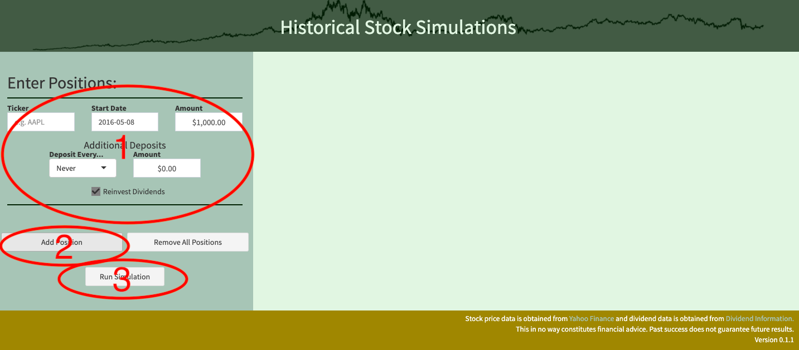
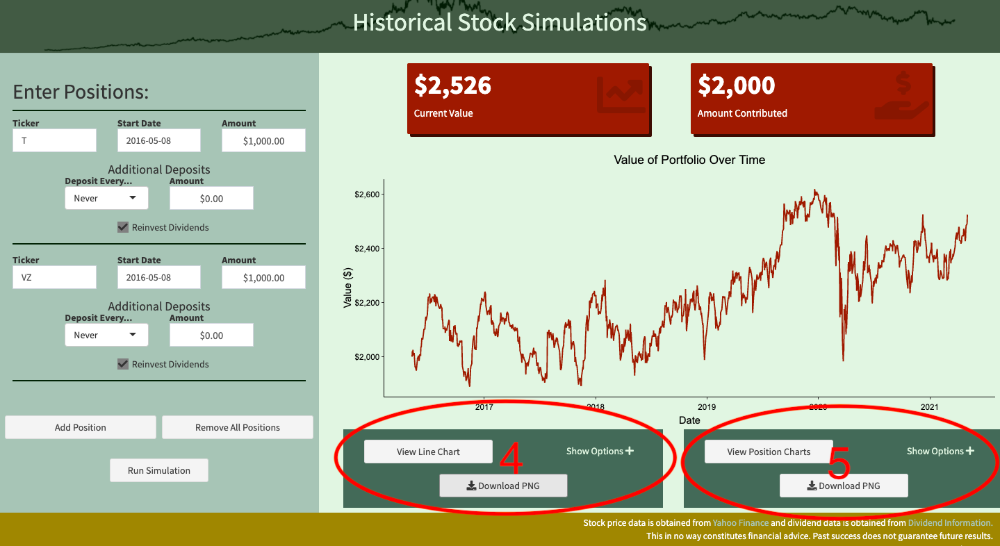
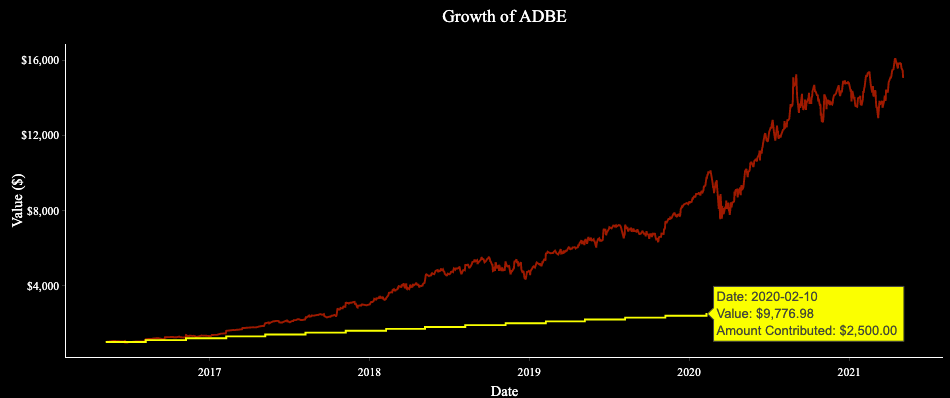

<!-- README.md is generated from README.Rmd. Please edit that file -->

```{r, include = FALSE}
knitr::opts_chunk$set(
  collapse = TRUE,
  comment = "#>",
  fig.path = "man/figures/README-",
  out.width = "100%"
)
library(dplyr)
devtools::load_all()
```

# `{historicalInvesting}`

<!-- badges: start -->
[](https://travis-ci.com/srmatth/historicalInvesting)
<!-- badges: end -->

The goal of historicalInvesting is to allow users to create beautiful charts showing the historical movements of stock prices based on given investments.
It is a shiny app created within the `{golem}` framework but also includes a couple of functions useful for getting historical prices and dividend data for any stock ticker.

## Access

You can access a live version of the app [here](https://spencermatthews.shinyapps.io/historicalInvesting/).

Or, install by following the instructions below and run on your own machine.

## Installation

You can install the most current version of `{historicalInvesting}` from [github](https://github.com/srmatth/historicalInvesting) with:

``` r
# install.packages("devtools")
devtools::install_github("srmatth/historicalInvesting")
```

## Basic Use of the App

Upon opening the app, the start page will appear as follows:



In the left sidebar, you may enter as many tickers (positions) as you would like.
In the area identified by 1, the ticker symbol is entered along with start date and starting amount.
Additionally, a specific amount can be contributed after each specified period of time using the inputs on the second row.
Finally, you can choose to reinvest dividends (default) or not by deselcting the checkbox.

To add another position, simply click the "Add Position" button and another setup identical to 1 will appear below 1.
Once all positions have been entered, clicking the "Run Simulation" button will simulate buying those positions at the given dates and their progress through today.

An example of the app after this button is click follows:


This view shows the current value of your positions and the total amount contributed in two cards at the top.
Beneath those is the default line chart, and underneath the line chart are widgets that allow for customization of the charts.

In 4, clicking on the "Show Options" button will expand the options which allow for changes to the background, line color, font, etc.
For example, see the customized chart below:



After the chart is customized as desired, it can be downloaded by clicking the "Download PNG" button.

In 5, a similar process can be taken with a chart that is split into different panels based on the ticker, so the growth of each ticker can be viewed individually.


## Basic Use of the Functions

`{historicalInvesting}` comes with two built-in functions for getting historical stock data.
The first is `get_historical_prices()` which takes a vector of tickers as its only argument and returns the historical prices for these tickers in one large data frame.
The data is obtained from [Yahoo Finance](https://finance.yahoo.com/) and it will automatically pull all data for the tickers between 1970 and the present.

```{r}
tkrs <- c("AAPL", "ADBE", "MSFT")
dat <- get_historical_prices(tkrs)

head(dat)
```

This data can easily be used to visualize the price of the stock over time:

```{r}
dat %>%
  ggplot2::ggplot() +
  ggplot2::aes(x = date, y = close) +
  ggplot2::geom_line() +
  ggplot2::facet_wrap(~ticker)
```

The other function is `get_historical_dividends()` which pulls its data from [Dividend Information](https://www.dividendinformation.com/).
It is a little bit more robust, in that you can specify tickers, a start date, and whether it should be verbose or not.
Using the same tickers above, we can get their dividend data as follows:

```{r}
tkrs <- c("AAPL", "ADBE", "MSFT")
div <- get_historical_dividends(tkrs)

head(div)
```

And again see how it has changed over time:

```{r}
div %>%
  ggplot2::ggplot() +
  ggplot2::aes(x = date, y = amount_per_share) +
  ggplot2::geom_step() +
  ggplot2::facet_wrap(~ticker)
```

These functions are very simplistic, to see more robust versions and other functions that aid in the webscraping of stock data, see my [`{value.investing}` package](https://github.com/srmatth/value.investing).


## Acknowledgements

The stock price data used in the package and app is obtained from [Yahoo Finance](https://finance.yahoo.com/).
The dividend data used is from [Dividend Information](https://www.dividendinformation.com/).


